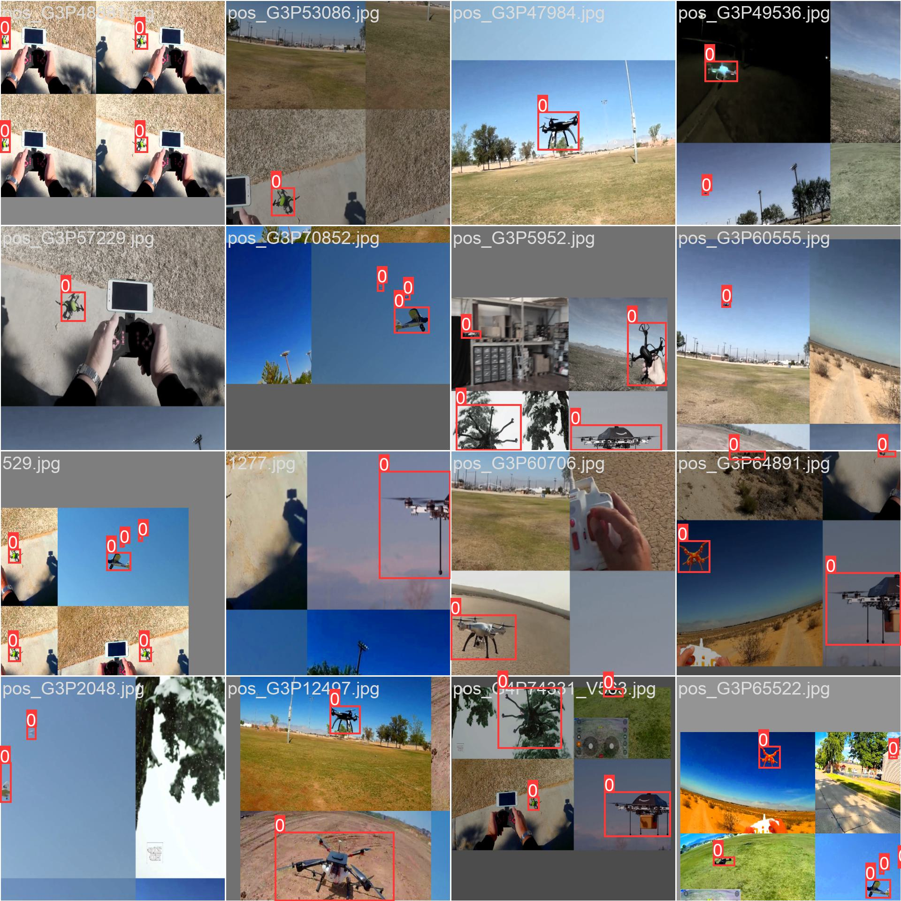

# MSHNet

# Detection (IEEE)

**Dataset Examples:**

**Result Examples:**

# Paper

# Related Papers

# Other Datasets & Resources

[Real World Object Detection Dataset for Quadcopter Unmanned Aerial Vehicle Detection | IEEE Journals & Magazine | IEEE Xplore](https://ieeexplore.ieee.org/document/9205392)

[Air-to-Air Visual Detection of Micro-UAVs: An Experimental Evaluation of Deep Learning | IEEE Journals & Magazine | IEEE Xplore](https://ieeexplore.ieee.org/document/9343737)

[On training datasets for machine learning-based visual relative localization of micro-scale UAVs | IEEE Conference Publication | IEEE Xplore](https://ieeexplore.ieee.org/document/9196947)

[A deep learning approach to drone monitoring | IEEE Conference Publication | IEEE Xplore](https://ieeexplore.ieee.org/document/8282120)

[Multi-target detection and tracking from a single camera in Unmanned Aerial Vehicles (UAVs) | IEEE Conference Publication | IEEE Xplore](https://ieeexplore.ieee.org/document/7759733)
